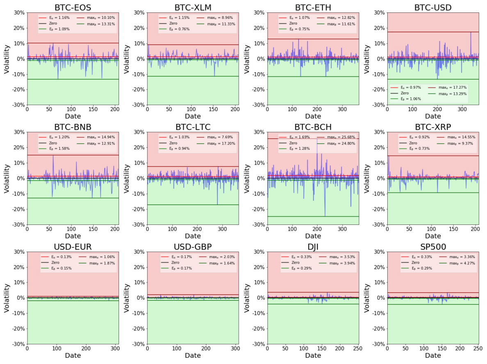
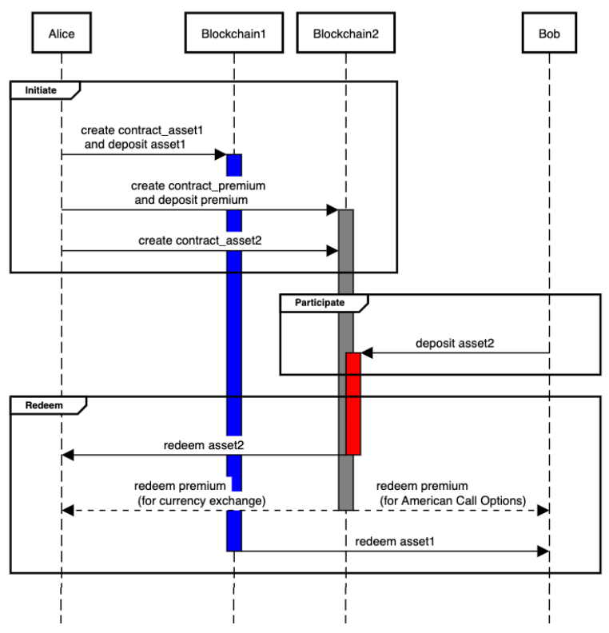

# Fair Atomic Swap

## Problem Explained

Atomic Swap enables two parties to atomically exchange their own cryptocurrencies without trusted third parties, by using Hashed Time-locked Contracts (HTLCs).

However, the Atomic Swap is unfair to the swap participant.

### Observation

We prove that an Atomic Swap is equivalent to an American Call Option without the premium, and the Atomic Swap is much more unfair on cryptocurrencies than on conventional financial assets (stocks and fiat currencies) in the same setting.

We use the conventional Cox-Ross-Rubinstein option pricing model in Finance to estimate the premium, and show that the estimated premium for cryptocurrencies is 2% ~ 3% of the asset value, while the premium for stocks and fiat currencies is approximately 0.3%.

### Existing Soluions

+ To make the Atomic Swap costly by charging setting up HTLCs, or increasing the transaction fee of HTLCs;
+ To use shorter timelock for Atomic Swaps;
+ To use a trusted third party (TTP);
+ ...

### However...

Unfortunately, they either have security flaws or significantly reduce the usability of Atomic Swaps.

## Design Rationale

+ To achieve the atomicity, HTLC is used.
+ The participant should decide whether to participate after the initiator locks the token and sets up the timelock.
+ The initiator should decide whether to proceed the swap (redeem the tokens from the participant and reveal the preimage of the hash lock), after the participant locks the tokens and sets up the time locks.
+ Premium is redeemable for the participant only if the participant participates in the swap and redeems the initiator's token before premium's timelock expires.
+ Premium is refundable for the initiator only if the initiator initiates but the participant does not participate in the swap at all.

## Our Solution

## Outcomes
+ Our paper [On the optionality and fairness of Atomic Swaps](https://eprint.iacr.org/2019/896) gets accepcted by [The First ACM Conference on Advances in Financial Technologies (AFT’19)](http://aft.acm.org)!
    * Paper repo can be found [here](https://github.com/fair-atomic-swap/fair-atomic-swap).
+ We propose [EIP-2266](https://github.com/ethereum/EIPs/blob/master/EIPS/eip-2266.md).

## About Us
+ [Runchao Han](https://runchao.rocks/) (Monash University and CSIRO-Data61)
+ [Haoyu Lin](https://chrislinn.ink/) (Bytom Foundation and KZen Research)
+ [Jiangshan Yu](https://www.jiangshanyu.com/) (Monash University)
